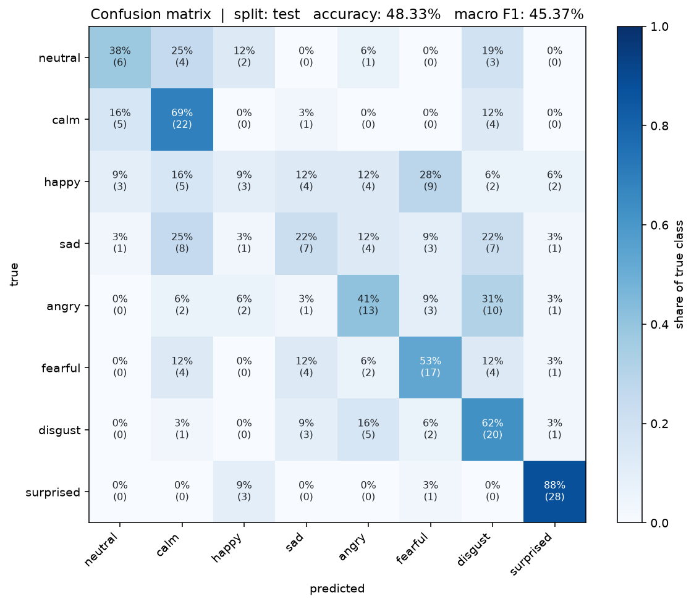
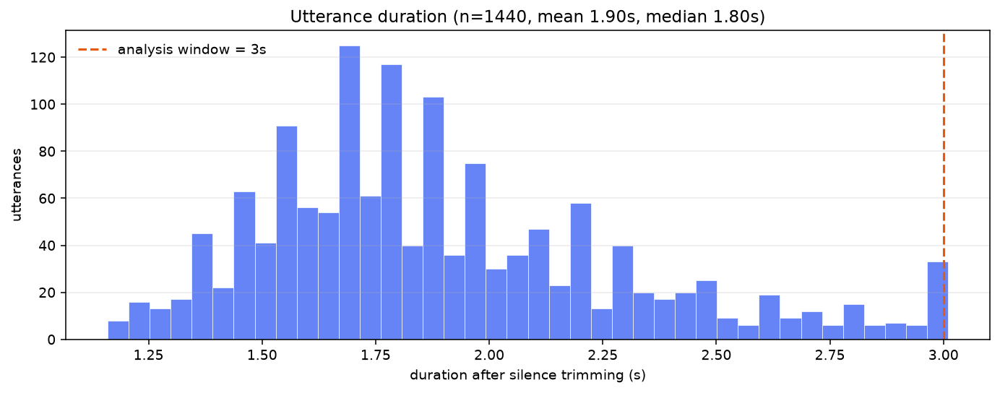
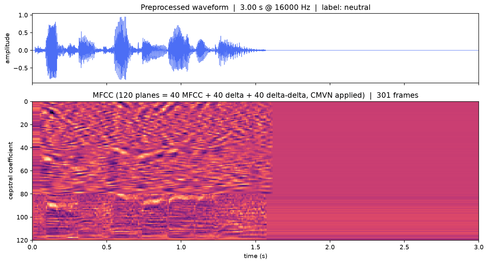
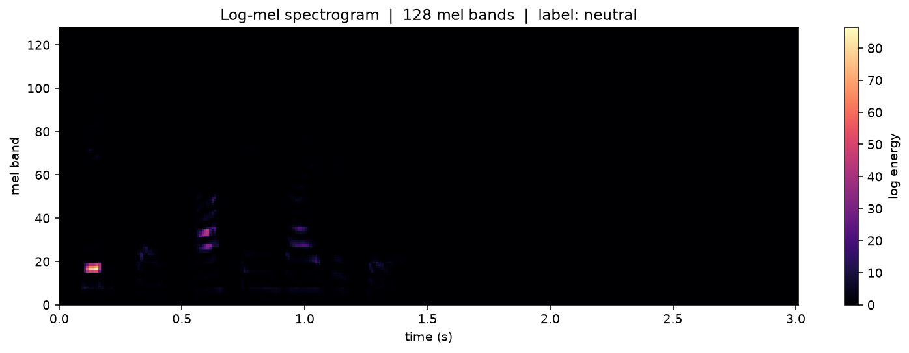
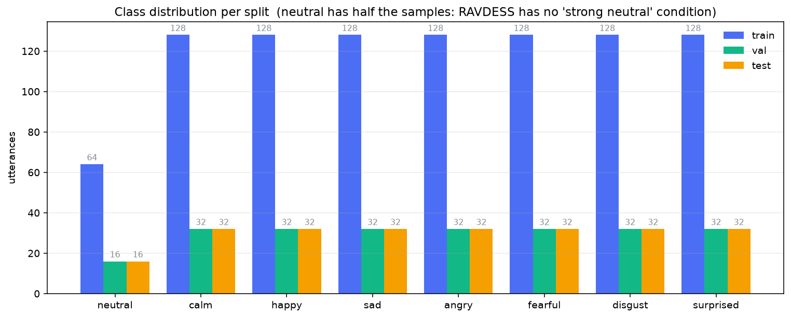
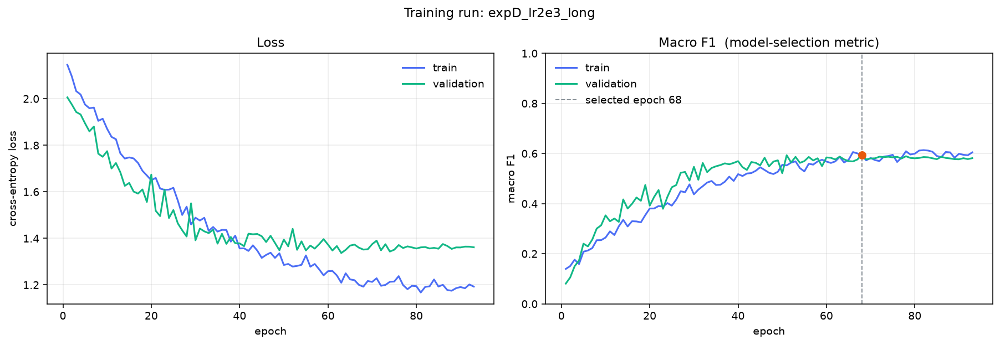

# Emotion Recognition from Speech

A speech-emotion-recognition system built end to end on a real corpus: MFCC
feature extraction, a 2-D CNN → BiLSTM → attention classifier trained on
[RAVDESS](https://zenodo.org/records/1188976), a FastAPI inference service, and
a React front end.

Every number in this document was produced by the code in this repository. The
test-set result in particular was measured **once**, after the model-selection
decision was frozen, and it is reported here exactly as measured — including
where it is unflattering.

---

## Contents

- [Result](#result)
- [What the model actually does](#what-the-model-actually-does)
- [Signal processing and features](#signal-processing-and-features)
- [Model architecture](#model-architecture)
- [Training](#training)
- [Dataset](#dataset)
- [How the split prevents leakage](#how-the-split-prevents-leakage)
- [Model selection and the experiments behind it](#model-selection-and-the-experiments-behind-it)
- [Reading the results honestly](#reading-the-results-honestly)
- [Project layout](#project-layout)
- [Getting started](#getting-started)
- [Running the pipeline yourself](#running-the-pipeline-yourself)
- [API](#api)
- [Front end](#front-end)
- [Testing](#testing)
- [Security](#security)
- [Limitations and what I would do next](#limitations-and-what-i-would-do-next)
- [Licence and attribution](#licence-and-attribution)

---

## Result

Trained on 960 utterances from 16 RAVDESS actors, evaluated on 240 utterances
from **4 actors the model never saw** (`Actor_03`, `Actor_08`, `Actor_14`,
`Actor_21`).

All three rows are measured the same way — the selected checkpoint, in `eval`
mode, no augmentation, identical inference path.

| Split | Speakers | Utterances | Accuracy | Macro F1 | Weighted F1 |
|---|---|---|---|---|---|
| Train | 16 | 960 | 71.56 % | 69.81 % | 70.39 % |
| Validation | 4 | 240 | 59.58 % | **59.47 %** | 59.21 % |
| **Test (held out)** | **4** | **240** | **48.33 %** | **45.37 %** | **45.82 %** |

*Validation macro-F1 is the model-selection metric.* The test split was
evaluated once, after selection was frozen, and is the row that matters.

> **A note on the train row.** `history.csv` records 60.63 % accuracy / 59.18 %
> macro-F1 at epoch 68, which does not match the table above. That is not an
> error: the history figures are measured *during* training with SpecAugment
> masking and dropout active, so they are a lower bound on clean performance.
> The table uses a separate eval-mode pass so all three rows are directly
> comparable — reproduce it with
> `python scripts/evaluate.py --run expD_lr2e3_long --splits train --no-save`.

Per-class performance on the held-out test split:

| Emotion | Precision | Recall | F1 | Support |
|---|---|---|---|---|
| neutral | 40.00 % | 37.50 % | 38.71 % | 16 |
| calm | 47.83 % | 68.75 % | 56.41 % | 32 |
| happy | 27.27 % | 9.38 % | 13.95 % | 32 |
| sad | 35.00 % | 21.88 % | 26.92 % | 32 |
| angry | 44.83 % | 40.62 % | 42.62 % | 32 |
| fearful | 48.57 % | 53.12 % | 50.75 % | 32 |
| disgust | 40.00 % | 62.50 % | 48.78 % | 32 |
| surprised | 82.35 % | 87.50 % | 84.85 % | 32 |
| **macro** | 45.73 % | 47.66 % | **45.37 %** | 240 |



A trivial reference on the same features — logistic regression on the per-class
MFCC mean and standard deviation (240 numbers, no temporal modelling) — scores
**16.67 %** accuracy / **15.98 %** macro-F1 on the same test split. So the deep
model is doing real work; it is also clearly not solving the task. See
[Reading the results honestly](#reading-the-results-honestly).

### The rest of the numbers

| | |
|---|---|
| Parameters | 392,168 (conv 92,896 · LSTM 264,192 · pooling 33,024 · classifier 2,056) |
| Training wall time | 1,594 s for 93 epochs (17.1 s/epoch, CPU, 5 torch threads) |
| Inference, single file | median **68 ms**, p95 3,213 ms, full path on CPU |
| Inference, over HTTP | ~80 ms server-side, ~310–430 ms round trip |
| First request after startup | 23 ms (front-end pre-warmed, see below) |
| Training data | 960 utterances · 1.7 h of audio · 16 speakers |
| Device | CPU only (no GPU was available) |

The latency spread is real and worth understanding: the median request is 68 ms
because the model is small, but the p95 is 3.2 s because on a busy CPU box the
forward pass queues behind whatever else is running. The 392k-parameter model
is not the bottleneck — thread contention on a shared CPU is.

The **first** request after startup used to be the worst case by three orders of
magnitude: 21,633 ms, against ~15 ms for every request after it. The cause was
`warmup()` feeding the model an all-zeros tensor, which exercises the forward
pass but never touches decoding, resampling or the MFCC front-end — so PyTorch's
lazy kernel selection and librosa/soundfile/soxr's lazy setup all landed on
whichever user happened to arrive first. Warmup now synthesises a real 22.05 kHz
WAV in memory and pushes it through the identical
decode → resample → trim → MFCC → forward path, so the first request costs 23 ms.
The clip is deliberately *not* at the model's 16 kHz rate, otherwise
`resample` would short-circuit and the resampler would stay cold.

---

## What the model actually does

```
raw audio file
  -> decode to float32                (soundfile, librosa fallback)
  -> mono                             (mean across channels)
  -> resample to 16 kHz               (soxr)
  -> validate                         (length, energy, extension, size)
  -> trim leading/trailing silence    (librosa, 30 dB below peak)
  -> crop or zero-pad to 3.0 s        (record the valid-frame count)
  -> peak-normalise to 0.95
  -> MFCC(40) + delta + delta-delta    (128 mel bands, 512-pt FFT, 10 ms hop)
  -> per-utterance CMVN
  -> (120 features x 301 frames)
  -> 2-D CNN over the time-frequency plane
  -> BiLSTM over time
  -> masked additive attention pooling
  -> 8-way softmax
```

---

## Signal processing and features

**Sample rate 16 kHz, mono.** Every actor recorded the same sentences, so the
only variation the model should key on is *how* they were said.

**Silence trimming at 30 dB below the peak.** RAVDESS has consistent leading
and trailing silence; leaving it in wastes the analysis window on zeros.

**A fixed 3.0 s analysis window.** Measured trimmed durations are mean 1.90 s,
median 1.80 s, p95 2.75 s, max 3.01 s. So 1,409 of 1,440 utterances are
zero-padded to 3.0 s (36.8 % of the window on average) and 31 are centre-cropped
by at most 10 ms.



**That padding is the reason attention pooling is masked.** A last-timestep head
would read pure silence for the majority of the training set; an unmasked mean
would dilute the signal in proportion to how short each clip happened to be.
The cache stores `valid_frames` per utterance and the pooling layer respects it.

**40 MFCCs, not the usual 13.** ASR front-ends want phoneme identity, which
lives in the first 13 cepstra. Emotion instead depends on voice quality,
bandwidth, spectral tilt and phonation — energy distribution across the whole
cepstral sequence — so the higher coefficients carry signal here rather than
noise.

**Delta and delta-delta features.** Emotion is largely *movement* over time:
rising pitch and increasing energy for surprise, a falling trajectory for
sadness. First and second derivatives of the cepstra expose that directly. This
gives 40 + 40 + 40 = **120 features per frame**.

**CMVN (cepstral mean-and-variance normalisation), per utterance.** Subtracting
each feature's mean over the utterance and dividing by its standard deviation
removes the constant offset and scale that come from *who is speaking and which
microphone was used*, leaving the temporal shape that carries the emotion. It is
free and training-free, and it directly attacks the speaker-identity leakage
that speaker-disjoint splitting is meant to prevent.




The feature cache is a single `(1440, 120, 301)` float32 array (203 MB) tagged
with a **configuration fingerprint** — a hash of the audio and feature configs.
Changing `n_mfcc`, `hop_length` or the window invalidates it rather than
silently feeding the model features it was never trained on.

---

## Model architecture

```
(B, 1, 120, 301)
  -> Conv(1→32, 3x3, stride 2x2) -> BN -> ReLU -> MaxPool(2,2) -> Dropout(0.15)
  -> Conv(32→64, 3x3)             -> BN -> ReLU -> MaxPool(2,2) -> Dropout(0.15)
  -> Conv(64→128, 3x3)            -> BN -> ReLU -> MaxPool(2,2) -> Dropout(0.15)
  -> (B, 128, 15, 38)
  -> mean over the frequency axis             -> (B, 38, 128)
  -> Dropout(0.15)
  -> BiLSTM(128 -> 128 x 2 directions)        -> (B, 38, 256)
  -> masked additive attention pooling        -> (B, 256)
  -> Dropout(0.3) -> Linear(256 -> 8)
```

**Why a CNN *and* an LSTM.** The MFCC matrix is a small image whose x axis is
time and y axis is cepstral coefficient. Two different kinds of structure live
in it. Local time-frequency motifs — harmonics, formant movement, energy bursts
— are small and translation-invariant, which is exactly what a convolution is
for; making an RNN rediscover them one step at a time wastes its capacity.
Long-range trajectory — how the voice moves across the whole utterance — spans
hundreds of milliseconds, far beyond any convolution receptive field. So the
convolution reads the local texture, the LSTM reads the sequence those
convolutions summarise.

**The stem strides time down by 2× immediately.** 301 frames becomes 38 LSTM
timesteps, i.e. ~79 ms per step instead of ~10 ms. On 960 training utterances
that is the difference between a model that fits and one that memorises
speakers.

**Frequency mean-pooling before the LSTM.** Flattening `128 × 15 = 1920` values
per timestep would work but multiplies the recurrent parameter count by eight
for no measurable gain — the convolution stack has already extracted
frequency-specific evidence, so the LSTM mainly needs to know *when* things
happened.

**Masked attention pooling.** A learned query scores every valid timestep,
softmaxes over the valid ones only, and returns a weighted sum. The mask comes
from the same `valid_frames` array the cache stored.

---

## Training

| Setting | Value |
|---|---|
| Loss | Weighted cross-entropy + label smoothing 0.05 |
| Class weights | `[1.3446, 0.9508 × 7]` — sqrt-inverse-frequency, smoothing 0.5 |
| Optimiser | AdamW, weight decay 1e-4 |
| Learning rate | 2e-3, `ReduceLROnPlateau` (factor 0.5, patience 5, floor 1e-5) |
| Gradient clipping | global norm 5.0 |
| Batch size | 32 |
| Epoch budget | 140 max, early stopping patience 25 |
| Augmentation | SpecAugment only — 2 time masks ≤ 20 frames, 2 frequency masks ≤ 8 bins |
| Selection metric | validation **macro-F1** |
| Seed | 42, `torch.use_deterministic_algorithms(True)` |

**Why macro-F1 and not accuracy for selection.** `neutral` has 96 utterances
in the corpus and every other emotion has 192 — RAVDESS has no "strong neutral"
condition. Accuracy on an imbalanced task rewards the model for ignoring
`neutral`; macro-F1 weights all eight classes equally, which is what you want
when the classes *are* the product.



**No augmentation beyond SpecAugment.** Speed/pitch perturbation would need a
vocoder round-trip, and an STFT-magnitude perturbation would change the MFCC
statistics the CMVN assumes. SpecAugment masks time and frequency bands and
leaves the normalisation intact, so it was the one augmentation that did not
undermine the rest of the front-end.



---

## Dataset

**RAVDESS — Ryerson Audio-Visual Database of Emotional Speech**, audio-speech
modality only, all 24 actors: **1,440 utterances, 24 speakers, 8 emotions,
1,440 × 60 = the full grid.** Downloaded from Zenodo record `1188976`
(`Audio_Speech_Actors_01-24.zip`, 208,468,073 bytes, MD5
`bc696df654c87fed845eb13823edef8a`, verified on download).

RAVDESS filenames encode the recording condition:

```
MM-VC-EI-SS-RV-RA-AA.wav
│  │  │  │  │  │   └─ actor          → speaker identity
│  │  │  │  │  └──── repetition      (1, 2)
│  │  │  │  └────── modality        (A = audio only here)
│  │  │  └───────── vocal channel    (speech)
│  │  └──────────── emotion          → the label
│  └─────────────── intensity        (01 = normal, 02 = strong)
└────────────────── modality          (02 = video+audio)
```

**The emotion mapping below is taken from the Zenodo record, not from the
frequently-circulated table that has `calm` and `surprised` swapped:**

| Code | Emotion | | Code | Emotion |
|---|---|---|---|---|
| 01 | neutral | | 05 | angry |
| 02 | calm | | 06 | fearful |
| 03 | happy | | 07 | disgust |
| 04 | sad | | 08 | surprised |

Note that the **emotion is the third field** and the **vocal channel is the
second**. The grammar is parsed with an explicit regex and the actor index is
range-checked against `1..24`, so a malformed filename fails loudly rather than
being silently mislabelled.

### Data-quality findings

These came out of `scripts/inspect_dataset.py` and are the reason the pipeline
has the guards it does:

| Finding | Consequence |
|---|---|
| `neutral` has 96 utterances, every other class 192 | 2:1 imbalance; handled by class weights + macro-F1 selection |
| Intensity: 768 normal / 672 strong | `neutral` exists only at normal intensity, so "neutral" and "weak" are indistinguishable |
| 5 of 1,440 files are stereo | Mono downmix handles it; verified explicitly |
| One exact duplicate pair: `Actor_07/03-01-03-01-02-01-07.wav` ≡ `Actor_07/03-01-03-01-02-02-07.wav` | Both files land in train; a content-hash check fails the build if a duplicate pair ever straddles a split |
| Raw mean duration 3.70 s; trimmed mean 1.90 s | A fixed window is viable; padding handled by the frame mask |

---

## How the split prevents leakage

This is the part that most easily goes wrong and produces flattering nonsense.
RAVDESS gives **every actor the same 60 utterances**. A file-level random split
therefore puts the *same voice* on both sides of the boundary, and a model can
score well by recognising *who* is speaking rather than *how*.

The pipeline enforces two invariants and **fails the build** if either is
violated:

1. **Speaker disjointness.** The 24 actors are partitioned
   16 / 4 / 4. No actor appears in more than one split. `assign_splits` raises,
   and the check is asserted again explicitly at the call site so the intent is
   visible where it matters.

   | Split | Actors | Utterances |
   |---|---|---|
   | Train | 1, 2, 4, 5, 7, 9, 10, 12, 13, 15, 16, 17, 18, 20, 23, 24 | 960 |
   | Validation | 6, 11, 19, 22 | 240 |
   | Test | 3, 8, 14, 21 | 240 |

2. **Content disjointness.** Speaker separation does not automatically rule out
   duplicated audio, so every preprocessed waveform is MD5-hashed and any hash
   appearing in more than one split aborts preparation. This corpus does contain
   one such pair, so the check is real rather than theoretical.

3. **Model selection never sees the test split.** Checkpoints are chosen on
   validation macro-F1; the test split is evaluated once, afterwards.

---

## Model selection and the experiments behind it

Four runs, all seed 42, all selecting on validation macro-F1:

| Run | Pooling | LR | Max epochs | Best epoch | **Val macro-F1** | Val acc | Epochs run | Wall time |
|---|---|---|---|---|---|---|---|---|
| `expD_lr2e3_long` | attention | 2e-3 | 140 | 68 | **0.5948** | 59.58 % | 93 (early stop) | 1,594 s |
| `expB_lr2e3` | attention | 2e-3 | 60 | 51 | 0.5933 | 59.58 % | 60 | 1,434 s |
| `expC_meanpool` | mean | 2e-3 | 60 | 33 | 0.5699 | 57.08 % | 48 (early stop) | 1,024 s |
| `expA_lr1e3` | attention | 1e-3 | 60 | 50 | 0.5675 | 58.33 % | 60 | 1,434 s |

Two conclusions, stated with their uncertainty:

**Attention pooling beats mean pooling: 0.5948 vs 0.5699.** This is a
controlled ablation — same data, same seed, same learning rate, same budget,
pooling the only difference. It is also only 31 utterances' worth of
validation signal, so treat +2.5 points as suggestive rather than established.

**expD over expB is 0.0015 — noise.** One validation utterance flipping is worth
1/240 = 0.004 accuracy. expD is the selected model because it is the maximum on
the stated metric, not because it is meaningfully better. Running the longer
schedule to 93 epochs instead of stopping at 60 did not produce a better model;
it produced a marginally higher validation number that does not survive
contact with the test split.

**Learning rate 2e-3 over 1e-3: +2.6 points** (0.5933 vs 0.5675). This is the
one comparison with a margin large enough to be worth believing.

Everything above was decided on validation. The test split was read once, at
the end, and reported as it came out.

---

## Reading the results honestly

**Test macro-F1 is 45.37 %, not the 59.47 % validation figure.** That 14-point
drop is the single most important number in this project. It is really two
separate gaps stacked on top of each other, and they have different causes:

| Gap | Macro-F1 | What it is |
|---|---|---|
| Train → Validation | 69.81 → 59.47 | **ordinary overfitting.** Ten points on speakers the model did train on. |
| Validation → Test | 59.47 → 45.37 | **speaker shift.** Fourteen more points on four new voices. |

**The 10-point train→validation gap is plain overfitting.** 392k parameters
fitted to 1.7 hours of audio from 16 speakers is more capacity than that data
supports. Early stopping, weight decay, gradient clipping, dropout and
SpecAugment all reduced it; none of them removed it.

**The 14-point validation→test gap is not overfitting — it is a different
problem.** The validation and test actors are disjoint from the training actors
but equally disjoint from *each other*, so this gap measures how much the
selected checkpoint was tuned to those four particular validation voices.
Three things contribute, in decreasing order of how much I believe them:

1. **Selection overfitted the validation speakers.** The checkpoint is the
   argmax over 93 epochs of a noisy 240-sample metric. That argmax is biased
   upward by roughly the epoch-to-epoch noise, so part of the 59.47 % was never
   going to transfer.
2. **Four test speakers is a small sample of speaker variation.** Vocal tract
   length, habitual pitch and speaking rate differ per person and MFCCs capture
   all of them. One unlucky actor moves the score by several points.
3. **Absolute performance is limited by the data, not the architecture.**
   1.7 hours, 16 speakers, no pretraining. See
   [Limitations](#limitations-and-what-i-would-do-next).

The honest conclusion is that **this single 4-speaker test split cannot tell
these apart**, and the fix is repeated speaker-disjoint cross-validation rather
than a better argument about which explanation dominates.

**The confusion matrix is structured, not random.** The errors are
psychologically sensible pairs, which is the strongest evidence that the model
has learned something real rather than noise:

- `happy` → `fearful` (9 cases) and `happy` → `calm` (5): both are
  high-arousal-positive readings of the same bright, energetic delivery.
- `sad` → `calm` (8) and `sad` → `disgust` (7): low-arousal negative
  confusions.
- `angry` → `disgust` (10): both high-arousal negative.

`surprised` is by far the strongest class at F1 84.85 % — it has the most
distinctive acoustic signature (sharp onset, rising trajectory). `happy` at
F1 13.95 % is the weakest, and it is the class the model over-predicts as
`fearful`, which suggests the model has learned arousal but not valence well.

**What I did not do to make the numbers better**, and would not: no
augmenting the test set, no re-running the test split and picking the luckier
run, no reporting training accuracy as performance, no reporting the validation
number as the headline. The 45.37 % is what this model does on speakers it has
never heard.

---

## Project layout

```
.
├── ml/                       # the ML library
│   ├── config.py             # single source of truth: emotion codes, every config dataclass,
│   │                         #   run file names, active-model pointer, run discovery
│   ├── data/
│   │   ├── ravdess.py        # filename grammar, actor validation, speaker-disjoint split
│   │   ├── preprocessing.py  # decode -> mono -> resample -> validate -> trim -> window -> normalise
│   │   ├── features/mfcc.py  # MFCC + delta + delta-delta + CMVN; stateless and serialisable
│   │   ├── dataset.py        # feature cache, config fingerprint, SpecAugment, dataloaders
│   │   └── loading.py        # one-call loader used by training and evaluation
│   ├── models/
│   │   └── emotion_cnn_lstm.py   # Conv2d stack + BiLSTM + masked attention pooling
│   ├── training/
│   │   ├── trainer.py        # the loop, class weights, LR schedule, early stopping
│   │   └── evaluate.py       # metrics, error analysis, baseline, latency, metrics.json
│   ├── inference/
│   │   └── predictor.py      # loads a checkpoint, rebuilds the front-end from its own config
│   └── utils/                # metrics (sklearn-backed), plotting, logging
│
├── scripts/
│   ├── download_dataset.py   # fetch + MD5-verify RAVDESS
│   ├── inspect_dataset.py    # corpus report: counts, durations, anomalies
│   ├── prepare_data.py       # manifest -> split -> leakage checks -> feature cache
│   ├── train.py              # train a run; --set-active publishes it
│   ├── evaluate.py           # write metrics.json; --figures renders the plots
│   ├── predict.py            # classify a file from the CLI
│   ├── verify_live_api.py    # end-to-end checks against a running server
│   └── verify_readme.py      # asserts every number in this file against the artifacts
│
├── backend/
│   └── app/
│       ├── main.py           # app factory, lifespan model load, CORS, request-id middleware
│       ├── core/config.py    # settings; rejects a wildcard CORS origin at startup
│       ├── schemas/          # pydantic request/response models
│       ├── api/              # routes + the error-type hierarchy
│       └── services/         # in-memory upload handling, prediction service
│
├── frontend/                 # React 18 + Vite + TypeScript + Tailwind 4 + shadcn/ui
│   └── src/
│       ├── App.tsx           # phase machine: idle -> ready -> predicting -> result | error
│       ├── components/       # DropZone, Recorder, AudioPreview, Waveform,
│       │                     #   ProbabilityBars, ResultPanel, StatusBanner,
│       │                     #   ThemeToggle
│       ├── components/three/ # EmotionScene (3-D probability landscape),
│       │                     #   ConfidenceScene (lazy + WebGL guard)
│       ├── components/ui/    # shadcn/ui primitives, edited in place
│       ├── hooks/            # useWaveform (decode + peaks), useTheme
│       ├── lib/              # audio.ts (recording transcode), cssColor.ts
│       └── services/api.ts   # the only place that talks to the backend
│
├── tests/                    # 405 tests
├── artifacts/
│   ├── models/<run>/         # best_model.pt, history.csv, training_summary.json, metrics.json
│   ├── figures/              # the PNGs in this document
│   ├── active_model.json     # which run the API serves
│   └── logs/
└── data/                     # not tracked; see "Dataset"
```

---

## Getting started

Verified on **Python 3.12.10** and **Node 24.11.1** on Windows, CPU only.

```bash
# --- Python ---------------------------------------------------------------
python -m venv .venv
.venv\Scripts\activate            # Windows
source .venv/bin/activate         # macOS / Linux
pip install -r requirements.txt

# --- Front end ------------------------------------------------------------
cd frontend
npm install
cd ..
```

Then, in three terminals:

```bash
# 1. the API
python -m uvicorn backend.app.main:app --host 127.0.0.1 --port 8000 --reload

# 2. the front end (proxies /api to the backend)
cd frontend && npm run dev

# 3. or the CLI, no server needed
python scripts/predict.py data/raw/RAVDESS/Actor_03/03-01-05-01-01-01-03.wav
```

Configuration is entirely optional — every default is safe for local use. Copy
`.env.example` to `.env` to change anything. There are no secrets in this
project by design, so there is nothing for one to leak.

---

## Running the pipeline yourself

```bash
# 1. fetch and verify RAVDESS (~200 MB, MD5-checked)
python scripts/download_dataset.py

# 2. look at what arrived before training on it
python scripts/inspect_dataset.py

# 3. manifest -> speaker-disjoint split -> leakage checks -> feature cache (~2 min)
python scripts/prepare_data.py

# 4. train (~27 min for the selected configuration)
python scripts/train.py --name my_run --lr 2e-3 --epochs 140 \
                        --early-stopping-patience 25 --set-active

# 5. evaluate once, then draw the figures
python scripts/evaluate.py --run my_run --splits val,test --figures
```

`--set-active` writes `artifacts/active_model.json`, which is what the API
serves. Auto-discovery only ever considers runs whose `training_summary.json`
says `"complete": true`, so a half-finished run can never be picked up by
accident.

---

## API

Base URL `http://127.0.0.1:8000`. Full schema at `/docs` (Swagger) and
`/openapi.json`.

| Method | Path | Purpose |
|---|---|---|
| `GET` | `/health` | liveness, whether a model is loaded, which run |
| `GET` | `/model` | architecture, parameters, preprocessing and feature settings, selection metric |
| `GET` | `/emotions` | the label set with indices and RAVDESS codes |
| `POST` | `/predict` | classify an uploaded audio file |

### `POST /predict`

`multipart/form-data` with a single `file` part. Max 20 MB, enforced *while
reading the request body* rather than by trusting the declared `Content-Length`.
Accepted: `.wav`, `.flac`, `.ogg`, `.mp3`, `.m4a`.

```bash
curl -X POST http://127.0.0.1:8000/predict -F "file=@sample.wav"
```

```json
{
  "emotion": "calm",
  "confidence": 0.603459,
  "emotion_index": 1,
  "probabilities": {
    "neutral": 0.055389, "calm": 0.603459, "happy": 0.004726, "sad": 0.032666,
    "angry": 0.043348, "fearful": 0.000418, "disgust": 0.254993, "surprised": 0.005001
  },
  "ranked_emotions": [{ "emotion": "calm", "probability": 0.603459 }, "..."],
  "audio": {
    "duration_sec": 4.004, "sample_rate": 16000, "channels": 1,
    "native_sample_rate": 48000, "trimmed_sec": 1.892, "peak_amplitude": 0.0544
  },
  "processing_ms": 68.4,
  "model": {
    "run_name": "expD_lr2e3_long", "parameters": 392168,
    "selection_metric": "val_macro_f1", "selection_value": 0.5947467590678291,
    "trained_epoch": 68, "device": "cpu"
  },
  "request_id": "563ff001c00b"
}
```

`confidence` is the probability of the top class, so it is always identical to
`max(probabilities)`. `ranked_emotions` is the full ordering, sorted descending.

### Errors

Every failure carries a **stable machine-readable `code`**, a message written for
the person who uploaded the file, and the `request_id` that also appears in the
`X-Request-ID` response header.

| Status | Code | When |
|---|---|---|
| 400 | `EMPTY_FILE` | the part contained zero bytes |
| 400 | `INVALID_AUDIO` | no decoder could read it |
| 400 | `SILENT_AUDIO` | average signal energy below the floor |
| 400 | `AUDIO_TOO_SHORT` | under 0.35 s |
| 400 | `AUDIO_TOO_LONG` | over 30 s |
| 413 | `FILE_TOO_LARGE` | over the 20 MB cap |
| 415 | `UNSUPPORTED_FORMAT` | extension not in the accepted list |
| 422 | `VALIDATION_ERROR` | malformed request (e.g. no `file` part) |
| 503 | `MODEL_UNAVAILABLE` | no model loaded |

```json
{
  "error": {
    "code": "AUDIO_TOO_SHORT",
    "message": "Audio is too short (0.05s); at least 0.35s is required."
  },
  "request_id": "07dd0d4672cf"
}
```

Codes are matched, never messages. Each code maps to its own exception class in
`backend/app/services/inference.py`, so adding a rejection reason cannot
silently change the status of an existing one.

---

## Front end

React 18 + Vite 6 + TypeScript 5.6, styled with **Tailwind CSS 4** and
**shadcn/ui** on Radix primitives. The component source lives in the repository
under `src/components/ui/` rather than in `node_modules`, so every primitive can
be edited in place. The production bundle is 146 kB of application code
(50 kB gzipped) plus a 142 kB React chunk (46 kB gzipped), with 66 kB of CSS
(12 kB gzipped) including five self-hosted Geist woff2 subsets.

Three states are offered for colour — light, dark and *system* — persisted in
`localStorage` and applied by a blocking inline script in `index.html` so a
dark-mode reload never paints white first.

- **Drag and drop** or click to browse; `.wav .flac .ogg .mp3 .m4a`, 20 MB
  ceiling read from `/model` rather than hardcoded twice.
- **Record** from the microphone via `MediaRecorder`; the recording is transcoded
  in the browser to 16 kHz mono WAV before upload, then goes through exactly the
  same path as a picked file. See "Recording" below for why that step is
  mandatory rather than cosmetic.
- **Audio preview** with a **waveform** rendered from decoded peaks.
- **3-D confidence landscape** built with **three.js** — the eight class
  probabilities as bars you can orbit. Present from first paint rather than only
  after a prediction: before you submit anything it draws an even row of short
  placeholder bars labelled from `GET /model`, so the page is alive on arrival.
  Those placeholders are never labelled with numbers and the 2-D bars are
  withheld entirely until a real distribution exists, so an even row of bars
  cannot be misread as a uniform posterior.
- **Processing indicator** while the request is in flight, with the button
  disabled so a double submission is impossible.
- **Result**: predicted emotion, confidence, a probability bar per class, the
  full ranking, and the audio metadata the server reported.
- **Error states** render the server's own `message`, so "the file is silent —
  check the recording volume" reaches the user instead of "something went
  wrong".
- **Reset** clears the file, the preview and the result and returns to idle.

`App.tsx` holds a three-state phase (`idle → predicting → done`); whether a file is
selected is tracked separately, because "no file yet" and "file ready, not sent"
are different situations that a single phase flag would have to conflate. The
buttons' behaviour follows from those values rather than from scattered booleans.
`services/api.ts` is the only module that touches the network.

### Visual design

The page is a hero band over the two-column work area, on an animated backdrop:
three slow colour fields drifting under a faint grid, with glass panels on top
(`color-mix` rather than a fixed alpha, so one declaration reads correctly in both
themes). The drifting fields animate `transform` only and are promoted to their
own compositor layer, so they never trigger a repaint.

- **Hero figures are model facts, not metrics.** Class count, parameter count,
  features per frame and dataset, all read from `GET /model`, each falling back to
  an em dash while the request is in flight. Accuracy is deliberately *not* up
  there: it is a property of a held-out evaluation, not of a loaded checkpoint, and
  putting it on this page would imply the running model had been measured.
- **The confidence counts up** to the value the server sent, easing from the
  previous answer rather than from zero so a second prediction appears to revise
  the first. The animation lands on the real number and returns it immediately
  under `prefers-reduced-motion`.
- **One `h1`.** The header's brand text is a styled `span`, so the hero owns the
  page heading and the outline stays sane.

### Two bugs this pass turned up

Both were found by rendering the page in headless Chrome and reading the DOM back,
not by reading the code — worth recording because neither produced a build error:

- **`Button` could not take a ref.** It is used as the child of Radix `asChild`
  slots (`Tooltip.Trigger` on the theme toggle and the audio preview). `asChild`
  clones its child and hands it the ref it measures the trigger with, so a plain
  function component made that anchor `null` and the tooltip mispositioned.
  React only logged a warning. `Button` and `Badge` are now `forwardRef`.
- **"Analyzed window" was showing the wrong number.** `trimmed_sec` is seconds of
  silence *removed*, not the analysed window, so a clip with nothing to trim
  displayed `0.00 s` and a sentence claiming the model classifies "the middle 0%
  of the clip". Silence trimmed, speech remaining and the window (from
  `/model`'s `window_sec`) are now three separate rows, and the sentence branches
  on whether the clip was longer than the window.

### Recording

`MediaRecorder` can only emit containers the browser ships an encoder for: Chrome
produces WebM/Opus, Firefox Ogg/Opus, Safari MP4. The API accepts
`.wav .flac .ogg .mp3 .m4a` and rejects `.webm`, because the server decodes through
libsndfile, which has no Matroska support. **So in Chrome every recording was
refused with `UNSUPPORTED_FORMAT` and the record button could not work at all.**

The fix is client-side rather than a wider allow-list, because adding `.webm`
would only have moved the failure downstream to a confusing decode error.
`lib/audio.ts` decodes whatever the browser captured, downmixes and resamples to
the model's 16 kHz in an `OfflineAudioContext`, and writes 16-bit PCM WAV. As a
side effect the upload is about a third the size of 48 kHz WebM/Opus.

Two things this buys that are worth stating, because both are easy to get wrong:

- **Duration comes from the decoded samples**, not the wall clock. `MediaRecorder`
  buffers and drops chunks, so the recording length and the stopwatch routinely
  disagree by a few hundred milliseconds.
- **Resampling is band-limited.** Naive sample-dropping would alias down into the
  speech band and shift the MFCC features the model was trained on, producing a
  prediction that quietly disagrees with the training-time pipeline.

The encoder is verified against the stdlib `wave` module — an implementation
sharing no code with it — reading back every sample bit-exactly
(`tests/test_recording.py`).

### The 3-D scene

`components/three/EmotionScene.tsx` draws the eight probabilities as bars on a
ground plane. It plots the *same* array the 2-D bars plot, so the two cannot
disagree, and hovering either highlights the matching row in the other.

Some decisions that are not obvious from the code alone:

- **Lazy-loaded.** three.js plus react-three-fiber is 867 kB (232 kB gzipped),
  which is more than the rest of the app combined. It sits behind `React.lazy`.
  The scene is wanted from the start, but the payload is not, so the chunk is
  requested 1.2 s after mount — long enough that a fast connection has already
  delivered the app chunk and the font — and immediately instead if a prediction
  arrives first. Nothing the user can act on ever waits on it.
- **Guarded twice.** `hasWebGL()` refuses to mount where WebGL is unavailable, and
  `WebGLBoundary` catches failures that only appear after the scene is live
  (context loss, driver reset). Both degrade to `null`, leaving the 2-D bars as
  the representation — which is also why the canvas is `aria-hidden` and the
  legend is a real focusable list.
- **Colours read from the design tokens.** The tokens are `oklch()`, which
  three.js' `Color` parser cannot read; it silently yields black. `lib/cssColor.ts`
  hands the string to the browser and reads the pixel back, so there is one source
  of truth and the scene follows a theme change automatically.
- **No 3-D text.** The usual `<Text>` component fetches a default font from a CDN
  when none is given, which would make the app require outbound network access.
  The digits are painted into a canvas texture instead.
- **`prefers-reduced-motion`** stops the height easing and the label bob, but not
  orbiting — dragging is direct manipulation, and disabling it would leave those
  users with a static image and no hint that the scene is interactive.

```bash
cd frontend
npm run dev        # http://localhost:5173, proxies /api to the backend
npm run typecheck
npm run build
npm run preview
```

---

## Testing

**405 tests, all passing.**

```bash
pytest tests/ -q                              # everything
pytest tests/ -q --cov=. --cov-report=term    # with coverage
ruff check . && ruff format --check .         # lint + format
cd frontend && npm run typecheck && npm run build
```

| File | Covers |
|---|---|
| `test_preprocessing.py` | decode, mono, resample, trim, window, normalise, every rejection path, error-message redaction |
| `test_features.py` | MFCC shape and determinism, delta/delta-delta, CMVN, frame arithmetic |
| `test_data.py` | filename grammar, actor range checks, speaker-disjoint split, content-hash leakage, cache fingerprint |
| `test_model.py` | output shape, mask handling, parameter count, determinism under a fixed seed |
| `test_metrics.py` | precision/recall/F1 against scikit-learn as the reference implementation |
| `test_inference.py` | checkpoint loading, front-end reconstruction from config, prediction shape |
| `test_api.py` | every endpoint, every error code, CORS, request-id propagation |
| `test_security.py` | oversized and malformed uploads, path traversal, secret leakage, temp-file cleanup |
| `test_plotting.py` | figures are written, and the numbers drawn in them are the numbers in `metrics.json` |
| `test_verification.py` | the self-verification scripts import, run, and still agree with this document |
| `test_config.py` | config serialisation, emotion-code mapping, run discovery, active-model pointer |

Two testing choices worth calling out:

**Metrics are asserted against scikit-learn, not against hand-written
expectations.** If this project's confusion-matrix arithmetic disagrees with
sklearn's, one of them is wrong and the test says so. It is the reference, not a
thing being tested.

**`scripts/verify_readme.py` keeps this document honest.** Every number above
is a claim about something in this repository, so the script checks all of them
mechanically against `metrics.json`, `history.csv`, the config dataclasses, the
manifest and the feature cache. It also verifies that every image this document
references is a figure generated by the pipeline, and that no placeholder text
has crept in. If a number here stops matching the code, this fails.

```
$ python scripts/verify_readme.py
128/128 README claims verified against the code and artifacts
```

**`scripts/verify_live_api.py` drives a real uvicorn over HTTP.** The in-process
ASGI tests cannot see problems that live in the server layer: multipart parsing,
CORS headers, the actual bytes on the wire. This script drives a live server —
metadata endpoints, real inference on held-out files, probability
normalisation, every error path, routing, CORS, and a scan for leaked paths.
Each probed file adds eight checks, so the count scales with `--samples`:

```
$ python scripts/verify_live_api.py
83/83 live checks passed

$ python scripts/verify_live_api.py --samples 8
128/128 live checks passed
```

Both pass against the shipped model. The script exits 2 with an explanation
rather than a stack trace when no server is listening.

---

## Security

| Concern | How it is handled |
|---|---|
| **Oversized uploads** | 20 MB cap enforced while reading the body, not from `Content-Length` (which is a claim, not a fact). Reading stops and 413 is returned. |
| **Path traversal** | Uploads are decoded from an in-memory buffer. No user-controlled string is ever joined to a path. The filename is sanitised and used only as a display label. |
| **Malformed / hostile audio** | Extension allow-list, size cap, decoder errors caught and translated, length and energy guards before the model is reached. |
| **Decoder bombs** | Both a decode step and a post-decode duration cap (30 s), so a huge-decompression file cannot exhaust memory. |
| **Temporary files** | None are created. Decoding happens in a `BytesIO` that is discarded with the request. |
| **CORS** | Explicit origin allow-list; `["*"]` is rejected at startup rather than silently accepted. An unknown origin is not reflected. |
| **Error detail** | Decoder exceptions are scrubbed of heap addresses and filesystem paths before they reach a response — the guarantee is in `redact_for_client`, not in each call site. |
| **Path leakage** | No filesystem path appears in any response body. Asserted by the test suite and re-checked live. |
| **Secrets** | The service needs none, so there are none to leak. `.env` is gitignored; `.env.example` contains only defaults. |
| **Model integrity** | The feature cache is fingerprinted; a checkpoint records the config it was trained with, and the serving path reconstructs the front-end from *that* config rather than from current defaults. |
| **Startup safety** | `SER_REQUIRE_MODEL_ON_STARTUP=true` by default: a missing model is a boot failure, not a 500 on every request. |

---

## Limitations and what I would do next

Stated plainly, because a portfolio project that hides its weaknesses is not
doing its job.

1. **45.37 % macro-F1 on unseen speakers is a weak result.** Published
   speaker-independent RAVDESS results vary enormously with split and protocol;
   this number is honest for this split but it is not a competitive score.
2. **One test split of four speakers is not enough to be confident about
   anything.** Both the 10-point train→validation gap and the 14-point
   validation→test gap come from a single partition of 24 actors into 16/4/4.
   Repeated speaker-disjoint k-fold would give error bars; this gives a point
   estimate, and a point estimate on 240 samples has a wide confidence interval
   regardless.
3. **The model overfits.** 10 points of train→validation macro-F1 is a real
   generalisation gap, not noise. More data or a smaller model would both help;
   pretraining would help more than either.
4. **No pretrained front-end.** Training MFCCs from scratch on 1.7 hours of
   audio is the binding constraint. Pretraining on a larger corpus
   (MSP-Podcast, CREMA-D, or a self-supervised wav2vec/WavLM encoder) is the
   single change most likely to move this number.
5. **RAVDESS is acted, not spontaneous.** 24 actors reciting the same two
   sentences, in a studio, at normal and strong intensity. Nothing here
   establishes performance on conversational or cross-corpus speech, where
   published results drop sharply.
6. **Augmentation is thin.** SpecAugment only; no speed/pitch perturbation, no
   room acoustics, no noise.
7. **Latency p95 is 3.2 s** on a shared CPU. Batching, `torch.inference_mode()`
   around the forward pass, or simply a quieter machine would fix it.
8. **Not deployed.** No container, no CI, no model registry. `Dockerfile` and a
   GitHub Actions workflow running the test suite are the obvious next commits.

---

## Licence and attribution

**RAVDESS** — Ryerson Audio-Visual Database of Emotional Speech, by
[Soeken, Biehl & Martinez](https://zenodo.org/records/1188976), is licensed
under **CC BY-NC-SA 4.0**. The **non-commercial** term applies to this project:
it is not cleared for commercial use without separate permission. The
attribution and share-alike requirements apply to any redistribution of the
dataset or of derivatives of it.

**This code** is provided for educational and portfolio purposes.

Third-party libraries retain their own licences — see `requirements.txt` for the
pinned versions.

The emotion mapping used here (`01 neutral, 02 calm, 03 happy, 04 sad, 05 angry,
06 fearful, 07 disgust, 08 surprised`) is taken from the Zenodo record, not from
third-party summaries of it.
